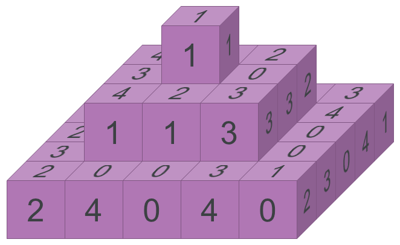
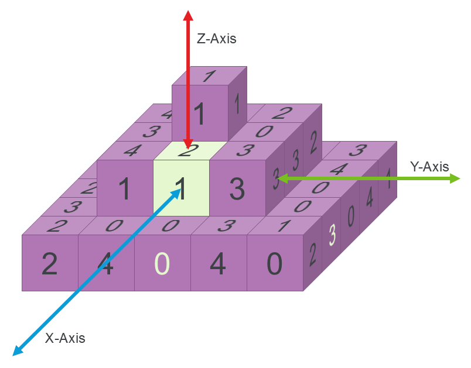
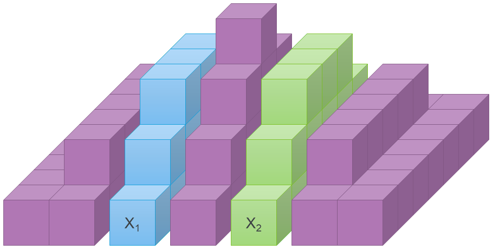

# Bel's Pyramid

Bel's Pyramid is a recreational mathematics puzzle invented by Dr. Belgacem Haba. The puzzle involves stacking cubes to create a square step pyramid, under the constraint that adjacent cube faces must have the same label. The cube faces are labeled in a special way that is detailed below. The pyramid has a certain number of layers N. This program searches for solutions using Boolean Satisfiability (SAT).

Solutions for Bel's Pyramid up to N=5 are currently known. It is hypothesized that multiple solutions exist for every N, but as of this writing, there is no known constructive approach for generating any solution for an arbitrary N. All known solutions for non-trivial values of N have been discovered using search (specifically SAT). SAT has been able to prove that some proposed constructive approaches are infeasible.

## Problem Description

The example in the diagram above shows the geometry of a solved pyramid with N=3 layers. Each layer $n\in[0,N)$ is a square with side length $2n+1$. The layers are aligned vertically along their center cubes to create a symmetric step pyramid. The total number of cubes in the pyramid is:
$$\sum_{n=0}^{N-1}(2n+1)^2 = \frac{1}{3}N(4N^2-1)$$
The N=3 cube in the diagram therefore has 1 + 9 + 25 = 35 cubes.

## Cube Labels

The cubes have labels on each of their faces, and the cubes must be stacked in a way that adjacent faces have matching labels. Importantly, the cubes always have the same label on opposite faces. Therefore a cube can have only 1, 2 or 3 distinct labels.

In a pyramid with N layers there are exactly $2N-1$ distinct labels. Each cube has a **unique labelling** $(a,b,c)$ which is generated by choosing 3 labels from the set of $2N-1$ **with replacement**. The number of possible combinations with replacement is identical to the number of cubes:

$$\left(\binom{2N-1}{3}\right) = \binom{(2N-1)+3-1}{3} = \frac{1}{3}N(2N-1)(2N+1) = \frac{1}{3}N(4N^2-1)$$

For convenience we use the set of integers $[0, 2N-1)$ to represent the labels, but they can be arbitrary distinct symbols.

Note that a permutation of the label tuple $(a,b,c)$ (e.g. $(c,a,b)$) corresponds to a spatial rotation of a cube, and is not a separate cube. Cubes with three different labels have 6 possible rotations, but cubes with repeated labels have fewer distinguishable rotations.

For the N=3 pyramid the 35 cubes are labeled from the set $[0,5)$ as follows:

|  |  |  |  |  |
| --- | --- | --- | --- | --- |
| (0, 0, 0) | (1, 1, 1) | (2, 2, 2) | (3, 3, 3) | (4, 4, 4) |
| (0, 0, 1) | (1, 1, 2) | (2, 2, 3) | (3, 3, 4) |
| (0, 0, 2) | (1, 1, 3) | (2, 2, 4) | (3, 4, 4) |
| (0, 0, 3) | (1, 1, 4) | (2, 3, 3) |
| (0, 0, 4) | (1, 2, 2) | (2, 3, 4) |
| (0, 1, 1) | (1, 2, 3) | (2, 4, 4) |
| (0, 1, 2) | (1, 2, 4) |
| (0, 1, 3) | (1, 3, 3) |
| (0, 1, 4) | (1, 3, 4) |
| (0, 2, 2) | (1, 4, 4) |
| (0, 2, 3) |
| (0, 2, 4) |
| (0, 3, 3) |
| (0, 3, 4) |
| (0, 4, 4) |

There are no duplicate cubes. Each cube is unique and must be used exactly once to solve the pyramid. Cubes can be placed into the pyramid with any rotation.

## Axis Labels

Due to the rule that opposite cube faces have identical labels, any line of cubes along an axis must have the same label all the way down the axis. Therefore we do not need to see the hidden faces to determine the state of the pyramid. It is only necessary to see the labels on the top, front, and right external faces of the pyramid.

In the above figure, we can infer that the highlighted cube must have the label tuple (1,2,3). The left and right faces that we cannot see must be 3 since all faces along the green Y-axis must have the same label 3 which is visible on the right external face of the pyramid.

Likewise, we can conclude that the cube immediately below the highlighted cube must be (0,2,3) because it shares the same label 2 on the Z-axis, and we can see the external face of the X-axis is 0 and the Y-axis is 3 (indicated by the highlighted labels on the bottom layer).

By placing a cube at a specific location in the pyramid with a specific rotation, we are therefore determining the labels along three orthogonal axes. Equivalently, if we set the labels on three orthogonal external faces, we are forcing a specific cube with a specific rotation at the intersection point of the axes through the faces. Doing either of these things further constrains the cubes that can be placed along the same X-, Y-, and Z-axes.

## Solution Representation

A solution to the pyramid can be written in a compact ASCII-art format suggested by Donald Knuth. This format shows the top, front, and right views of the pyramid similar to an architect's elevation drawing. This is enough to describe the position and rotation of every cube. Here is the solution representation for the same N=3 pyramid shown in the previous figures:

    +----------------+
    |  2  1  1  4  3 |  1
    |  2  4  1  2  4 |  4  2
    |  2  3  1  0  0 |  0  3  1
    |  3  4  2  3  0 |  3  3
    |  2  0  0  3  1 |  2
    +----------------+
       2  4  0  4  0
          1  1  3
             1

The square section visualizes the Z-axis labels as if looking at the pyramid from above. The triangle on the right side shows all of the Y-axis labels, and the triangle at the bottom shows all of the X-axis labels.

## Constructive Solutions

Ideally, we could find an algorithmic process for constructing solutions for any N. It is tempting to seek a recursive process that uses the solution for an N-1 pyramid to solve the N pyramid quickly. Two such proposals are given below, and SAT can be used to easily show that they do not generalize.

### Adding a New Base Layer

The "new base layer" approach takes a solved pyramid with N-1 layers and adds the next layer of size $(2N-1) \times (2N-1)$ underneath it. An N-layer pyramid has two additional labels compared to an N-1 pyramid. This means that all of the cubes with the two new labels must be located on the new bottom layer. This property applies for each layer up to the top of the pyramid. In general, layer $n$ can only use cubes with labels $l < 2n+1$ The cube at the top of the pyramid is the trivial N=1 subproblem with the cube (0,0,0).

This recursive approach works only for N up to 3 and is UNSAT for N=4. Here is a solution for N=3:

    +----------------+
    |  3  4  4  4  3 |  0
    |  3  2  1  1  1 |  4  0
    |  3  2  0  2  1 |  3  2  0
    |  2  1  2  1  3 |  3  1
    |  4  4  3  4  2 |  4
    +----------------+
       3  2  0  4  1
          2  0  1
             0

### Adding a New Shell on Top

This approach takes a solved N-1 pyramid and drops an additional layer of cubes on top of it to create a N-layer pyramid. All of the cubes with the two new labels are on top of the pyramid, wrapping around the previous pyramid. This pattern continues until you reach the trivial (0,0,0) pyramid in the very center of the bottom layer.

This approach works for N up to 3 and is UNSAT for N=4. Here is a solution for N=3:

    +----------------+
    |  4  0  4  2  4 |  4
    |  2  1  1  1  3 |  1  4
    |  0  2  0  0  1 |  0  0  3
    |  4  2  2  2  0 |  2  3
    |  3  1  3  2  3 |  3
    +----------------+
       4  1  0  2  3
          4  1  3
             4

## Program Installation
    # git clone https://github.com/acmihal/bel_pyramid.git
    # cd bel_pyramid
    # pip install -e .

## Usage

    # bel_pyramid -h
    # bel_pyramid 3

The program is also capable of exporting the formulation in CNF format for an external SAT solver:

    # bel_pyramid 3 --cnf bp3.cnf --skip-solver
    # kissat bp3.cnf > bp3.cert

A certificate produced by an external solver can be reimported to print the solution:

    # bel_pyramid 3 --cert bp3.cert

## Details

**bel_pyramid** is implemented in Python using Z3Py. The constraint formulation uses bounded integer variables for the axis label assignments, and Boolean variables to indicate that a cube is placed at a certain coordinate with a certain rotation. There are only two types of constraints: a cube uniqueness constraint asserts that each cube must be placed at exactly one coordinate with one rotation. This is an exactly-1 cardinality constraint over the Boolean placement variables for each cube. The second type of constraint asserts that a conjunction of three orthogonal axis assignments are equivalent to one of the Boolean placement variables.

A collection of experimental symmetry-breaking strategies is available via the **--strategy** parameter. Multiple strategies can be used in combination. Not all strategies are mutually compatible and may result in UNSAT configurations.

| Strategy | Description |
| --- | --- |
| BottomCenter012 | Each cube in the pyramid can have 1, 2, or 3 unique labels. This strategy weakly breaks label permutation symmetries by constraining the bottom center cube to (0,0,0), (0,0,1), or (0,1,2). The bottom center cube is chosen because its axes control the most additional cubes. |
| TopCubeOrdering | The top cube in the pyramid can be flipped on the x/y axes without affecting any other cubes in the pyramid. This strategy breaks that geometric symmetry by constraining the labels $x <= y$. |
| CakeSliceOrdering | "Cake Slices" are subsets of a pyramid made by taking all the blocks along an x or y axis plus all the blocks on top of that axis. See the figure below for a pictorial example. Cake slices on opposite sides of the centerline can be swapped without affecting other blocks in the pyramid. This strategy breaks this symmetry by asserting that the axis labels on the left-of-center slice are lexicographically ordered before the axis labels on the right-of-center slice $X_1 <= X_2$. |
| AntiMirror | A composition of other strategies intended to break various geometric mirroring symmetries. Empirically found to not improve performance. |
| IncreasingXAxis | Asserts that the X-axis labels on the bottom layer should be monotonically increasing. |
| LabelPermutation | Asserts that the solution must use the lexicographically-first permutation of labels. The Z-axis labels are considered first in the ordering. Solutions with this strategy will feature a zero in the upper-left corner of the Z-axis matrix, and the labels will increase reading the matrix in row-major order. This is a strong label permutation symmetry breaking constraint. |
| LabelPermutationImportance | A weaker version of LabelPermutation that orders the axis label variables differently to favor axes that are longer and control a larger number of additional cubes. Only some of the axis label variables are constrained. |
| FacePBEQ | A lookahead constraint to stop the solver from exploring subspaces where too many axes have been assigned to the same label, such that there aren't enough blocks with that label to fill all the axes. Empirically found to not improve solver performance. |
| FacePBLE | A variant of the FacePBEQ lookahead constraint that also does not improve performance. |

A number of constructive strategies are also implemented:

| Constructive Strategy | Description |
| --- | --- |
| ConstructiveBottom | A recursive constructive approach that adds layer N below a solved N-1 pyramid. Known to be UNSAT for N=4. |
| ConstructiveShell | A recursive constructive approach that adds layer N on top of a solved N-1 pyramid. Known to be UNSAT for N=4. |
| ConstructiveDiagonal | A recursive constructive approach that places a solved N-1 pyramid in the upper-left corner, and then adds the additional layer N blocks on top and to the bottom-right. Known to be UNSAT for N=5. |
| ConstructiveTripleDiagonal | A partial constructive approach that hypothesizes that the 'triple' blocks (i.e. those with only one unique label (0,0,0), (1,1,1), (2,2,2) etc.) should be placed along the diagonal of the bottom layer. Known to be SAT for N <= 5. |
| ZRing | A partial constructive approach that assigns the outermost Z-axis labels, where the pyramid height is 1 cube. Lacks an explicit justification. |
| YStep | A partial constructive approach that assigns all of the Y-axis labels. Known to work up to N=5. |
| XStep | A variation on YStep applied to the X-axis labels. Using XStep and YStep in combination is UNSAT for N=3. |

### Finite Domain Encoding

The program includes a **--finite-domain** parameter which can be set to either **int** or **enum**. The default **int** uses Z3 bounded integer variables for the axis labels. Using **enum** causes the program to use an EnumSort instead. Not all symmetry breaking strategies are compatible with enum due to the lack of an ordering.

The Z3 solver tactic can also be changed with the **--tactic** parameter. Allowable values are qffd, qflia, and z3-default.

The fastest known configuration is to use the ConstructiveTripleDiagonal and YStep strategies together with the **enum** finite domain encoding. Kissat can solve an N=5 pyramid with this configuration in about 30 seconds.

## Proposed Benchmarks

A set of hand-selected benchmarks for measuring the performance of SAT solvers can be generated using the **generate_benchmarks.sh** command.

| Benchmark | Satisfiable? | Kissat Runtime (seconds) |
| --- | --- | --- |
| bp4 | SAT | 10.26 |
| bp4_am | SAT | 2.73 |
| bp4_cbottom | UNSAT | 60.73 |
| bp4_cdiag | SAT | 4.58 |
| bp4_cshell | UNSAT | 18.09 |
| bp4_enum | SAT | 12.19 |
| bp4_lp | SAT | 26.46 |
| bp4_zring_ctd | SAT | 100.02 |
| bp5_ctd | SAT | 233.16 |
| bp5_ctd_enum | SAT | 183.81 |
| bp5_lp_ctd | SAT | 657.63 |
| bp5_ystep_ctd | SAT | 306.68 |
| bp5_ystep_ctd_enum | SAT | 33.52 |
| bp5_ystem_zring | SAT | 129.88 |

## Example Solutions

### N=1

    # bel_pyramid 1
    Solving Bel's Pyramid for 1 levels.

    Parameters:
        Levels: 1
        Level Sizes: [1]
        Level Cubes: [1]
        Total Cubes: 1
        Labels: [0]
        Label Sort: Int

    Variables:
        X Axis Variables: 1
        Y Axis Variables: 1
        Z Axis Variables: 1
        Placement Variables: 1

    Constraints:
        Axis Label Bounds: 3
        Placement Equalities: 1
        Cube Uniqueness Constraints: 1

    Constraint formulation built in 0.00 seconds.

    Starting solver with tactic "qffd".
    Solver finished in 0.00 seconds.

    Solution:
    +----+
    |  0 |  0
    +----+
       0

### N=2

    # bel_pyramid 2
    Solving Bel's Pyramid for 2 levels.

    Parameters:
        Levels: 2
        Level Sizes: [1, 3]
        Level Cubes: [1, 9]
        Total Cubes: 10
        Labels: [0, 1, 2]
        Label Sort: Int

    Variables:
        X Axis Variables: 4
        Y Axis Variables: 4
        Z Axis Variables: 9
        Placement Variables: 270

    Constraints:
        Axis Label Bounds: 17
        Placement Equalities: 270
        Cube Uniqueness Constraints: 10

    Constraint formulation built in 0.05 seconds.

    Starting solver with tactic "qffd".
    Solver finished in 0.01 seconds.

    Solution:
    +----------+
    |  1  2  1 |  1
    |  0  2  0 |  0  0
    |  1  2  1 |  2
    +----------+
       1  2  0
          0

### N=3

    # bel_pyramid 3
    Solving Bel's Pyramid for 3 levels.

    Parameters:
        Levels: 3
        Level Sizes: [1, 3, 5]
        Level Cubes: [1, 9, 25]
        Total Cubes: 35
        Labels: [0, 1, 2, 3, 4]
        Label Sort: Int

    Variables:
        X Axis Variables: 9
        Y Axis Variables: 9
        Z Axis Variables: 25
        Placement Variables: 4375

    Constraints:
        Axis Label Bounds: 43
        Placement Equalities: 4375
        Cube Uniqueness Constraints: 35

    Constraint formulation built in 0.68 seconds.

    Starting solver with tactic "qffd".
    Solver finished in 0.29 seconds.

    Solution:
    +----------------+
    |  4  3  4  4  1 |  4
    |  2  1  2  0  4 |  2  0
    |  3  4  3  2  2 |  2  0  3
    |  4  0  1  1  3 |  3  0
    |  1  1  4  1  1 |  1
    +----------------+
       3  0  4  2  1
          4  3  0
             3

### N=4
    # bel_pyramid 4
    Solving Bel's Pyramid for 4 levels.

    Parameters:
        Levels: 4
        Level Sizes: [1, 3, 5, 7]
        Level Cubes: [1, 9, 25, 49]
        Total Cubes: 84
        Labels: [0, 1, 2, 3, 4, 5, 6]
        Label Sort: Int

    Variables:
        X Axis Variables: 16
        Y Axis Variables: 16
        Z Axis Variables: 49
        Placement Variables: 28812

    Constraints:
        Axis Label Bounds: 81
        Placement Equalities: 28812
        Cube Uniqueness Constraints: 84

    Constraint formulation built in 4.00 seconds.

    Starting solver with tactic "qffd".
    Solver finished in 3.05 seconds.

    Solution:
    +----------------------+
    |  6  2  2  6  6  1  3 |  2
    |  0  0  0  6  5  0  1 |  0  2
    |  4  4  6  4  1  4  1 |  6  1  6
    |  2  3  6  2  1  3  1 |  1  2  5  2
    |  5  5  1  3  4  4  0 |  0  4  3
    |  5  5  3  0  4  1  1 |  5  2
    |  3  3  3  6  4  3  1 |  3
    +----------------------+
       5  3  6  6  4  0  1
          5  3  0  2  4
             5  4  5
                2

### N=5
This example demonstrates exporting CNF, calling an external SAT solver, and reimporting the certificate for validation and solution printout.

    # bel_pyramid 5 --strategy ConstructiveTripleDiagonal --cnf bp5_ctd.cnf --skip-solver
    Solving Bel's Pyramid for 5 levels.

    Parameters:
        Levels: 5
        Level Sizes: [1, 3, 5, 7, 9]
        Level Cubes: [1, 9, 25, 49, 81]
        Total Cubes: 165
        Labels: [0, 1, 2, 3, 4, 5, 6, 7, 8]
        Label Sort: Int

    Variables:
        X Axis Variables: 25
        Y Axis Variables: 25
        Z Axis Variables: 81
        Placement Variables: 120285

    Constraints:
        Axis Label Bounds: 131
        Placement Equalities: 120285
        Cube Uniqueness Constraints: 165

    Strategy ConstructiveTripleDiagonal applied 9 constraint(s).

    Constraint formulation built in 16.95 seconds.

    Exporting formulation to CNF file "bp5_ctd.cnf".
    CNF exported in 619.53 seconds.

    Skipping the solver.

    # time kissat bp5_ctd.cnf > bp5_ctd.cert
    real    6m55.819s
    user    6m54.967s
    sys     0m0.850s
    # bel_pyramid 5 --cert bp5_ctd.cert
    Solving Bel's Pyramid for 5 levels.

    Parameters:
        Levels: 5
        Level Sizes: [1, 3, 5, 7, 9]
        Level Cubes: [1, 9, 25, 49, 81]
        Total Cubes: 165
        Labels: [0, 1, 2, 3, 4, 5, 6, 7, 8]
        Label Sort: Int

    Variables:
        X Axis Variables: 25
        Y Axis Variables: 25
        Z Axis Variables: 81
        Placement Variables: 120285

    Constraints:
        Axis Label Bounds: 131
        Placement Equalities: 120285
        Cube Uniqueness Constraints: 165

    Constraint formulation built in 17.40 seconds.

    Importing certificate from file "bp5_ctd.cert".
    Certificate applied 120285 assertion(s).

    Starting solver with tactic "qffd".
    Solver finished in 1.43 seconds.

    Solution:
    +----------------------------+
    |  0  8  0  3  2  3  4  3  3 |  0
    |  0  1  7  6  1  5  1  8  1 |  1  2
    |  2  2  2  8  2  4  2  3  8 |  2  3  5
    |  0  1  3  3  6  1  0  7  4 |  3  5  8  3
    |  7  4  4  7  4  0  6  6  0 |  4  8  8  4  4
    |  5  4  1  5  4  5  6  0  7 |  5  6  6  3
    |  2  6  5  6  2  7  6  7  6 |  6  7  7
    |  0  1  7  1  1  4  6  7  7 |  7  0
    |  8  8  2  1  7  5  3  0  8 |  8
    +----------------------------+
       0  1  2  3  4  5  6  7  8
          1  2  3  4  0  0  1
             5  8  8  5  2
                7  3  4
                   7