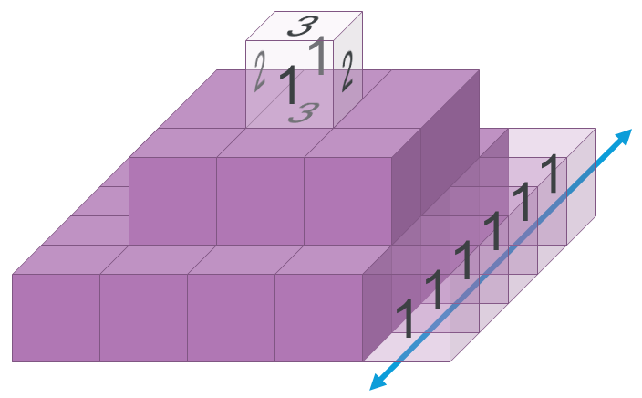

# Bel's Pyramid

Bel's Pyramid is a recreational mathematics puzzle invented by Dr. Belgacem Haba. The puzzle involves stacking cubes to create a square step pyramid, under the constraint that adjacent cube faces must have the same label. The cube faces are labeled in a special way that is detailed below. The pyramid has a certain number of layers N. This program searches for solutions using Boolean Satisfiability (SAT).

Solutions for Bel's Pyramid up to N=5 are currently known. It is hypothesized that multiple solutions exist for every N, but as of this writing, there is no known constructive approach for generating any solution for an arbitrary N. All known solutions for non-trivial values of N have been discovered using search (specifically SAT). SAT has been able to prove that some proposed constructive approaches are infeasible.

## Problem Description

The example in the diagram above shows the geometry of a solved pyramid with N=3 layers. Each layer $n\in[0,N)$ is a square with side length $2n+1$. The layers are aligned vertically along their center cubes to create a symmetric step pyramid. The total number of cubes in the pyramid is:
$$\sum_{n=0}^{N-1}(2n+1)^2 = \frac{1}{3}N(4N^2-1)$$
The N=3 cube in the diagram therefore has 1 + 9 + 25 = 35 cubes.

## Cube Labels

The cubes have labels on each of their faces, and the cubes must be stacked in a way that adjacent faces have matching labels. Importantly, the cubes always have the same label on opposite faces. Therefore a cube can have only 1, 2 or 3 distinct labels.

In a pyramid with N layers there are exactly $2N-1$ distinct labels. Each cube has a **unique labelling** $(a,b,c)$ which is generated by choosing 3 labels from the set of $2N-1$ **with replacement**. The number of possible combinations with replacement is identical to the number of cubes:

$$\left(\binom{2N-1}{3}\right) = \binom{(2N-1)+3-1}{3} = \frac{1}{3}N(2N-1)(2N+1) = \frac{1}{3}N(4N^2-1)$$

For convenience we use the set of integers $[0, 2N-1)$ to represent the labels, but they can be arbitrary distinct symbols.

Note that a permutation of the label tuple $(a,b,c)$ (e.g. $(c,a,b)$) corresponds to a spatial rotation of a cube, and is not a separate cube. Cubes with three different labels have 6 possible rotations, but cubes with repeated labels have fewer distinguishable rotations.

For the N=3 pyramid the 35 cubes are labeled from the set $[0,5)$ as follows:

|  |  |  |  |  |
| --- | --- | --- | --- | --- |
| (0, 0, 0) | (1, 1, 1) | (2, 2, 2) | (3, 3, 3) | (4, 4, 4) |
| (0, 0, 1) | (1, 1, 2) | (2, 2, 3) | (3, 3, 4) |
| (0, 0, 2) | (1, 1, 3) | (2, 2, 4) | (3, 4, 4) |
| (0, 0, 3) | (1, 1, 4) | (2, 3, 3) |
| (0, 0, 4) | (1, 2, 2) | (2, 3, 4) |
| (0, 1, 1) | (1, 2, 3) | (2, 4, 4) |
| (0, 1, 2) | (1, 2, 4) |
| (0, 1, 3) | (1, 3, 3) |
| (0, 1, 4) | (1, 3, 4) |
| (0, 2, 2) | (1, 4, 4) |
| (0, 2, 3) |
| (0, 2, 4) |
| (0, 3, 3) |
| (0, 3, 4) |
| (0, 4, 4) |

There are no duplicate cubes. Each cube is unique and must be used exactly once to solve the pyramid. Cubes can be placed into the pyramid with any rotation.

## Axis Labels

Due to the rule that opposite cube faces have identical labels, any line of cubes along an axis must have the same label all the down the axis. Therefore we do not need to see the hidden faces to determine the state of the pyramid. It is only necessary to see the labels on the top, front, and right external faces of the pyramid.

In the above figure, we can infer that the highlighted cube must have the label tuple (1,2,3). The left and right faces that we cannot see must be 3 since all faces along the green Y-axis must have the same label 3 which is visible on the right external face of the pyramid.

Likewise, we can conclude that the cube immediately below the highlighted cube must be (0,2,3) because it shares the same label 2 on the Z-axis, and we can see the external face of the X-axis is 0 and the Y-axis is 3 (indicated by the highlighted labels on the bottom layer).

By placing a cube at a specific location in the pyramid with a specific rotation, we are therefore determining the labels along three orthogonal axes. Equivalently, if we set the labels on three orthogonal external faces, we are forcing a specific cube with a specific rotation at the intersection point of the axes through the faces. Doing either of these things further constrains the cubes that can be placed along the same X-, Y-, and Z-axes.

## Solution Representation

A solution to the pyramid can be written in a compact ASCII-art format suggested by Donald Knuth. This format shows the top, front, and right views of the pyramid similar to an architect's elevation drawing. This is enough to describe the position and rotation of every cube. Here is the solution representation for the same N=3 pyramid shown in the previous figures:

    Solution:
    +----------------+
    |  2  1  1  4  3 |  1
    |  2  4  1  2  4 |  4  2
    |  2  3  1  0  0 |  0  3  1
    |  3  4  2  3  0 |  3  3
    |  2  0  0  3  1 |  2
    +----------------+
       2  4  0  4  0
          1  1  3
             1

The square section visualizes the Z-axis labels as if looking at the pyramid from above. The triangle on the right side shows all of the Y-axis labels, and the triangle at the bottom shows all of the X-axis labels.

## Complexity

The puzzle can be viewed as either a block placement problem or as an axis label assignment problem.

If we consider the block placement approach, the complexity is $O(N^3!)$. It is easy to see that a majority of the blocks can be placed before eventually having to fill a gap where two or three faces are already constrained, only to find that there are no free blocks left that match those labels.

If we consider the axis label assignment approach, there are $O(N^2)$ axes that can each be assigned one of $O(N)$ labels for a complexity of $O(N^{N^2})$. The challenge in this approach is that after assigning labels to a majority of the axes, there can be an axis remaining that can't have any label without resulting in a duplicate cube in the pyramid.

When either of these approaches gets stuck, it is necessary to undo a bunch of decisions to try to get out of the unsolvable situation. Unfortunately it is usually unclear how much work needs to be erased and redone. This characteristic makes searching for a solution very slow.

The problem is also hard due to symmetries. One such symmetry is 90-degree rotations of the entire pyramid. If a partially-constructed pyramid is proven to be impossible to complete, there is no point in visiting that same search space with a different rotation because that will also be unsolvable.

Another symmetry is the permutations of the labels. If we were to swap all the 0's and 1's, for example, the problem is equivalent.

## Constructive Solutions

Ideally, we could find an algorithmic process for constructing solutions for any N. It is tempting to seek a recursive process that uses the solution for an N-1 pyramid to solve the N pyramid quickly. Two such proposals have been tried and proven to not work:

### Adding a New Base Layer

The "new base layer" approach takes a solved pyramid with N-1 layers and adds the next layer of size $2N-1$ x $2N-1$ underneath it. An N-layer pyramid has two additional labels compared to an N-1 pyramid. This means that all of the cubes with the two new labels must be located on the new bottom layer. This property applies for each layer up to the top of the pyramid. In general, layer $n$ can only use cubes with labels $l < 2n+1$ The cube at the top of the pyramid is the trivial N=1 subproblem with the cube (0,0,0).

This recursive approach works only for N up to 3 and is UNSAT for N=4. Here is a solution for N=3:

    Solution:
    +----------------+
    |  3  4  4  4  3 |  0
    |  3  2  1  1  1 |  4  0
    |  3  2  0  2  1 |  3  2  0
    |  2  1  2  1  3 |  3  1
    |  4  4  3  4  2 |  4
    +----------------+
       3  2  0  4  1
          2  0  1
             0

### Adding a New Shell on Top

This approach takes a solved N-1 pyramid and drops an additional layer of cubes on top of it to create a N-layer pyramid. All of the cubes with the two new labels are on top of the pyramid, wrapping around the previous pyramid. This continues until you reach the trivial (0,0,0) pyramid in the very center of the bottom layer.

This approach works for N up to 3 and is UNSAT for N=4. Here is a solution for N=3:

    Solution:
    +----------------+
    |  4  0  4  2  4 |  4
    |  2  1  1  1  3 |  1  4
    |  0  2  0  0  1 |  0  0  3
    |  4  2  2  2  0 |  2  3
    |  3  1  3  2  3 |  3
    +----------------+
       4  1  0  2  3
          4  1  3
             4

## Program Installation
    # git clone https://github.com/acmihal/bel_pyramid.git
    # cd bel_pyramid
    # pip install -e .

## Usage

    # bel_pyramid -h
    # bel_pyramid 3

## Example Solutions

    # bel_pyramid 4
    Solving for 4 levels.

    Parameters:
        Level sizes: [1, 3, 5, 7]
        Level blocks: [1, 9, 25, 49]
        Total blocks: 84
        Labels: [0, 7)

    Constraint formulation built in 4.10 seconds.
    Solver finished in 2472.57 seconds

    Solution:
    +----------------------+
    |  6  3  0  6  2  4  6 |  6
    |  0  3  2  0  2  4  0 |  2  5
    |  5  4  4  0  2  4  1 |  3  0  6
    |  3  1  2  3  1  1  6 |  3  1  3  5
    |  0  1  1  0  1  4  6 |  1  4  5
    |  1  2  4  1  2  4  3 |  4  6
    |  5  2  5  6  5  2  5 |  5
    +----------------------+
       5  3  0  0  2  4  6
          6  2  0  1  5
             6  3  5
                4
